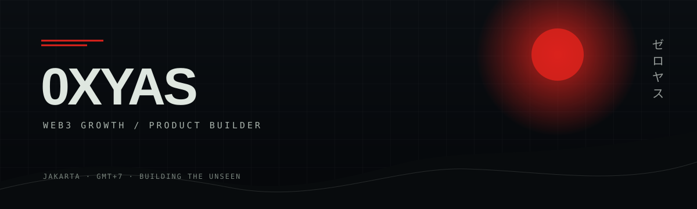

<div align="center">
  <a href="https://www.0xyas.xyz"></a>
</div>

<div align="center">
  <br />
  <a href="https://www.0xyas.xyz"></a>
  <a href="https://x.com/calbuldelis69"></a>
  <a href="https://www.linkedin.com/in/imam-i"></a>
</div>

## Builder brain. Growth instinct.

I build Web3 products, automation, and growth systems that turn attention into active communities. Currently **Marketing Manager at [Xora Finance](https://xora.finance)** and founder of **[Bountix](https://bountix.xyz)**, working remotely from Jakarta.

```text
FOCUS      product building · growth strategy · community systems
BUILD      AI workflows · automation · bots · API integrations
OPERATE    Linux · VPS · deployment · Web3 research
```

## Selected work

| Project | What it is | Stack / Focus |
| :--- | :--- | :--- |
| **[iNeed AI](https://ineed.web.id)** | AI model access platform built to help beginners start using modern AI through one simple interface and API. | AI Infrastructure · API · Product |
| **[Bountix](https://bountix.xyz)** | Web3 bounty platform connecting projects with contributors through structured on-chain work. | Product · Web3 · Community |
| **[King Bitget Bot](https://github.com/salsabila2507/bitget-llm-bot)** | LLM-assisted Bitget USDT futures bot with dry-run learning, Telegram controls, and selectable trade profiles. | Python · LLM · Trading Automation |
| **[0XYAS Portfolio](https://github.com/salsabila2507/0xyas-portfolio)** | Cinematic interactive portfolio powered by the ThreeUI Kage experience. | Three.js · WebGL · Creative Dev |
| **[OpenSea Minter](https://github.com/salsabila2507/opminter)** | Telegram-controlled SeaDrop minting engine with scheduling and chain detection. | Rust · EVM · Telegram |
| **[Confidential Payment](https://github.com/salsabila2507/confidential-payment)** | Privacy-preserving token transfers using the iExec Nox protocol. | TypeScript · Arbitrum · Privacy |
| **[Coasty Excalidraw](https://github.com/salsabila2507/coasty-excalidraw)** | Autonomous agent for building visual threat models in Excalidraw. | Python · AI · Security |
| **[Bountix Stellar](https://github.com/salsabila2507/bountix-stellar)** | Bountix marketplace implementation for Stellar and Soroban. | TypeScript · Stellar · Soroban |

## Toolkit


---

<div align="center"><sub>Building from Jakarta · GMT+7 · <a href="mailto:arkhanalghozali18@gmail.com">Let’s make something useful.</a></sub></div>
